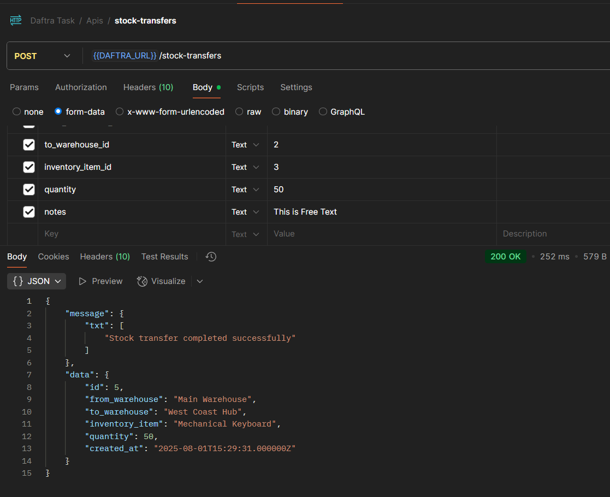
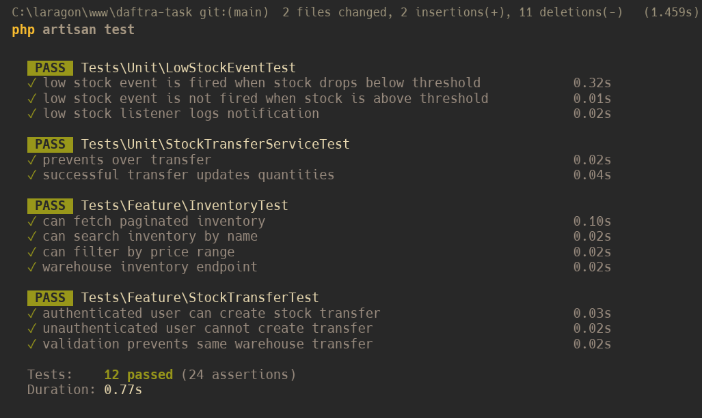
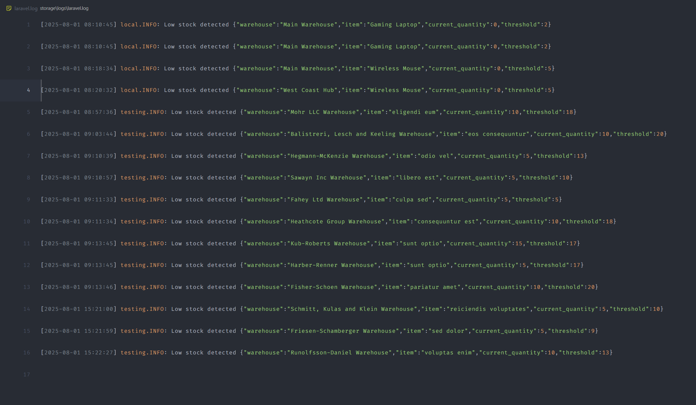

# Inventory Management API

A RESTful API for managing inventory across multiple warehouses built with Laravel 12. This system allows you to manage warehouses, inventory items, stock levels, and transfers between warehouses with comprehensive authentication and caching.

## 📋 Table of Contents

- [Project Overview](#project-overview)
- [Features](#features)
- [Requirements](#requirements)
- [Installation](#installation)
- [Configuration](#configuration)
- [Database Setup](#database-setup)
- [Authentication](#authentication)
- [Running the Application](#running-the-application)
- [API Documentation](#api-documentation)
- [Testing](#testing)
- [Screenshots](#screenshots)
- [Contact](#contact)

## 🎯 Project Overview

This project implements a simplified RESTful API for managing inventory across multiple warehouses. It includes warehouse management, inventory tracking, stock transfers, and automated low stock notifications.

### Key Components:
- **Warehouses**: Manage multiple warehouse locations
- **Inventory Items**: Track products with SKU, name, and pricing
- **Stock Management**: Monitor quantities per warehouse
- **Stock Transfers**: Handle inventory movement between warehouses
- **Low Stock Alerts**: Automated notifications for low inventory levels

## ✨ Features

- **Multi-Warehouse Inventory Management**
- **Stock Transfer System** with validation
- **Advanced Search & Filtering** (name, price range, warehouse)
- **Efficient Pagination** for large datasets
- **Caching System** for optimized warehouse inventory retrieval
- **Event-Driven Architecture** (LowStockDetected events)
- **API Authentication** using Laravel Sanctum
- **Comprehensive Testing** (Unit, Feature, and Event tests)
- **Input Validation & Security** against SQL injection

## 🛠 Requirements

Before you begin, ensure you have the following installed on your system:

- **PHP**: 8.4 or higher
- **Laravel**: 12.x
- **Composer**: 2.8.9 or higher
- **MySQL**: 5.7 or higher (for production)
- **SQLite**: (for testing only)
- **Redis**: (optional, for caching)

## 🚀 Installation

Follow these steps to get the project up and running:

### 1. Clone the Repository

```bash
git clone git@github.com:BNhashem16/daftra-task.git
cd daftra-task
```

### 2. Install PHP Dependencies

```bash
composer install
```

### 3. Environment Configuration

Copy the example environment file and configure it:

```bash
cp .env.example .env
```

Generate application key:

```bash
php artisan key:generate
```

## ⚙️ Configuration

### Environment Variables

Update your `.env` file with the following configurations:

#### Database Configuration (MySQL)
```env
DB_CONNECTION=mysql
DB_HOST=127.0.0.1
DB_PORT=3306
DB_DATABASE=inventory_management
DB_USERNAME=your_username
DB_PASSWORD=your_password
```

#### Application Settings
```env
APP_NAME="Daftra App"
APP_ENV=local
APP_KEY=base64:[generated-key]
APP_DEBUG=true
APP_URL=https://daftra-task.test/
```

#### Cache Configuration (Optional - Redis)
```env
CACHE_DRIVER=redis
REDIS_HOST=127.0.0.1
REDIS_PASSWORD=null
REDIS_PORT=6379
```

## 🗄️ Database Setup

### 1. Create Database

Create a MySQL database for your application:

```sql
CREATE DATABASE daftra;
```

### 2. Run Migrations

Execute the database migrations to create all required tables:

```bash
php artisan migrate
```

### 3. Seed the Database

Populate the database with sample data using the seeders:

```bash
php artisan db:seed
```

This will create:
- Sample warehouses
- Sample inventory items
- Initial stock levels
- Test users for authentication

### Alternative: Run Migrations with Seeding

```bash
php artisan migrate --seed
```

## 🔐 Authentication

This API uses **Laravel Sanctum** for authentication. To access protected endpoints:

### 1. Login to get API Token

```bash
# Login to get token
POST /api/v1/login
{
    "email": "admin@example.com",
    "password": "password"
}
```

### 2. Use Token in Headers

```bash
Authorization: Bearer your-api-token-here // Token already shared between apis just click on submit button of login api only
```

## 🏃‍♂️ Running the Application

### Development Server

Start the Laravel development server:

```bash
php artisan serve
```

The application will be available at: `http://localhost:8000`

If you use Largon Localhost you can use: `https://daftra-task.test/`

### Queue Workers (for Event Processing)

Start the queue worker to process low stock notifications:

```bash
php artisan queue:work
```

### Cache Management

Clear cache when needed:

```bash
php artisan cache:clear
```

## 📚 API Documentation

### Base URL
```
http://localhost:8000/api/v1
```

### Core Endpoints

#### Authentication

- `POST /api/v1/login` - Login user

#### Inventory Management
- `GET /api/v1/inventory` - Get paginated inventory across all warehouses
  - Query params: `search`, `min_price`, `max_price`, `page`, `per_page`
- `GET /api/warehouses/{id}/inventory` - Get inventory for specific warehouse (cached)
- `POST /api/stock-transfers` - Transfer stock between warehouses (requires auth)

### Request/Response Examples

#### Get Inventory with Filters
```bash
GET /api/v1/inventory?search=laptop&min_price=500&max_price=2000&page=1&per_page=10

Response:
{
    "message": {
        "txt": [
            null
        ]
    },
    "data": {
        "data": [
            {
                "id": 1,
                "name": "Gaming Laptop",
                "sku": "LAPTOP-001",
                "low_stock_threshold": 2,
                "description": "High-performance gaming laptop with 16GB RAM and 512GB SSD.",
                "price": "1299.99",
                "total_stock": 170,
                "stocks": [
                    {
                        "id": 1,
                        "warehouse": {
                            "id": 1,
                            "name": "Main Warehouse",
                            "location": "El Sheikh Zayed - Cairo"
                        },
                        "quantity": 0
                    },
                    {
                        "id": 6,
                        "warehouse": {
                            "id": 2,
                            "name": "West Coast Hub",
                            "location": "6th of October - Cairo"
                        },
                        "quantity": 79
                    },
                    {
                        "id": 11,
                        "warehouse": {
                            "id": 3,
                            "name": "Distribution Center",
                            "location": "Nasr City - Cairo"
                        },
                        "quantity": 91
                    }
                ]
            }
        ],
        "meta": {
            "current_page": 1,
            "last_page": 4,
            "per_page": 1,
            "total": 4,
            "from": 1,
            "to": 1,
            "path": "https://daftra-task.test/api/v1/inventory"
        },
        "links": {
            "first": "https://daftra-task.test/api/v1/inventory?page=1",
            "last": "https://daftra-task.test/api/v1/inventory?page=4",
            "prev": null,
            "next": "https://daftra-task.test/api/v1/inventory?page=2"
        }
    }
}
```

#### Stock Transfer
```bash
POST /api/v1/stock-transfers
Authorization: Bearer your-token

{
    "inventory_item_id": 1,
    "from_warehouse_id": 1,
    "to_warehouse_id": 2,
    "quantity": 10,
    "notes": "Monthly stock redistribution"
}

Response:
{
    "message": {
        "txt": [
            "Stock transfer completed successfully"
        ]
    },
    "data": {
        "id": 4,
        "from_warehouse": "Main Warehouse",
        "to_warehouse": "West Coast Hub",
        "inventory_item": "Wireless Mouse",
        "quantity": 152,
        "created_at": "2025-08-01T15:15:27.000000Z"
    }
}
```

### Postman Collection

A comprehensive Postman collection is included in the `/docs/postman` directory:
- File: `Inventory-Management-API.postman_collection.json`
- Environment: `Inventory-API-Environment.postman_environment.json`

#### Import Steps:
1. Open Postman
2. Click "Import"
3. Select both collection and environment files
4. Update environment variables (DAFTRA_URL, DAFTRA_AUTHORIZATION)

## 🧪 Testing

This project includes comprehensive tests covering all key functionality using SQLite for the test database.

### Test Categories

#### Unit Tests
- Stock update logic validation
- Over-transfer prevention
- Low stock detection algorithms

#### Feature Tests
- API endpoint functionality

#### Event Tests
- LowStockDetected event firing
- Event listener execution

### Running Tests

```bash
# Run all tests
php artisan test

# Run specific test suites
php artisan test --testsuite=Unit
php artisan test --testsuite=Feature

# Run specific test files
php artisan test tests/Unit/StockTransferServiceTest.php
php artisan test tests/Unit/LowStockEventTest.php
php artisan test tests/Feature/InventoryTest.php
php artisan test tests/Feature/StockTransferTest.php
```

### Test Database Configuration

Tests use SQLite in memory. Configuration in `phpunit.xml`:

```xml
<env name="DB_CONNECTION" value="sqlite"/>
<env name="DB_DATABASE" value=":memory:"/>
<env name="CACHE_DRIVER" value="array"/>
<env name="QUEUE_CONNECTION" value="sync"/>
```

## 📸 Screenshots

### Stock Transfer Success


### Test Results


### Low Stock Event Triggered


## 🔧 Additional Features

### Caching Strategy
- Warehouse inventory endpoints are cached for 5 minutes

### Event System
- `LowStockDetected` event triggers when stock falls below threshold

### Security Features
- Input validation and sanitization
- SQL injection prevention through Eloquent ORM

### Error Handling
- Structured error responses
- Validation error details
- Logging for debugging

## 📞 Contact

**Developer**: Hashem  
**Phone**: +201157569289  
**Email**: hashem.codes@gmail.com

---
## 📄 License

This project is licensed under the [MIT License](LICENSE).

---

**Built with ❤️ using Laravel 12 & PHP 8.4**  
*Inventory Management System - Backend Developer Test Task*